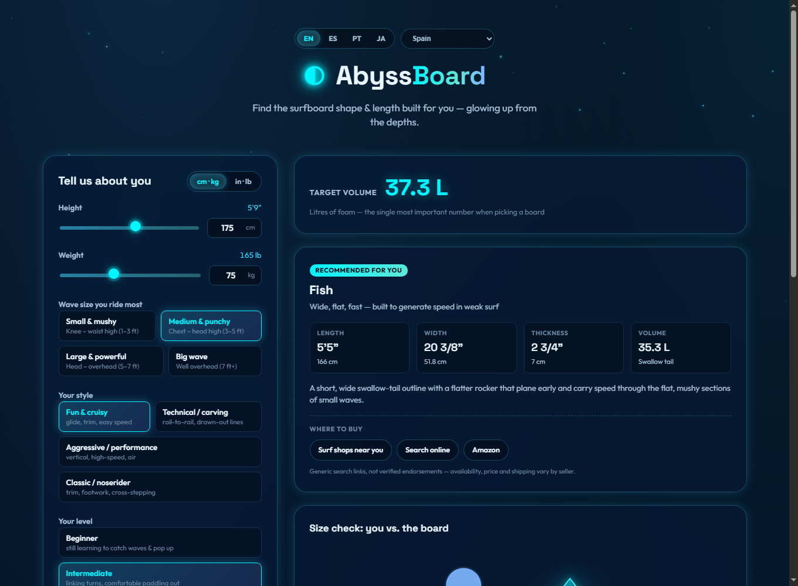

<div align="center">

# 🌊 AbyssBoard

**Find the surfboard shape & length built for you — glowing up from the depths.**

A personalised surfboard sizing tool: tell it your height, weight, wave conditions,
style and level, and it recommends a board archetype, dimensions and volume —
with a visual size comparison against your own silhouette.

[](#-tech-stack)
[](#-getting-started)
[](#-multilingual)



</div>

---

## ✨ What it does

Answer a few questions and AbyssBoard works out:

- 🎯 **Target volume** (litres of foam) — using the Guild-factor formula, adjusted
  for skill level, paddle fitness, board material and wave size/style.
- 🏄 **Recommended archetype** — picked from 8 real board types (soft-top, funboard,
  fish, groveler, shortboard, step-up, gun, longboard) by scoring how well each
  one's typical proportions and use-case fit your target volume, wave size and style.
- 📐 **Length · width · thickness** — solved from the target volume using each
  archetype's realistic length/width/thickness ratios, then clamped to sane ranges.
- 🧍 **A size-check silhouette** — your body next to the board's actual plan-shape
  outline, both drawn to the same real-world scale (cm), so you can *see* the fit
  instead of just reading numbers.
- 🥈 A solid alternative pick, in case the top match isn't quite your vibe.

## 🎨 Board outlines that actually look like boards

Every archetype's outline is traced from hand-drawn reference shapes — real rail
lines, real nose/tail treatments — not a generic parametric blob. Swallow tails
actually notch, pintails actually pinch to a point, and each shape is rendered with
a soft neon glow that matches the app's bioluminescent, "glowing up from the depths"
theme.

## 🛒 Where to buy

Each recommendation comes with region-aware shopping links: **surf shops near
you** (Google Maps), a **web search**, and **Amazon** for the recommended
board's regional marketplace. The shopping region is guessed instantly from
your browser's timezone (no permission prompt, no network call) and can be
overridden manually from the dropdown next to the language switcher. These are
always generic, live search links, not a hardcoded list of named shops — so
they never go stale or point at businesses that no longer exist.

## 🌐 Multilingual

Fully localised UI — **English, Español, Português and 日本語** — including every
label, board description, and recommendation note. Auto-detects your browser's
language on first visit, remembers your choice, and switches instantly with no
page reload.

## 🧩 Tech stack

Zero dependencies. Zero build step. Just open `index.html`.

- **Vanilla HTML/CSS/JS** — no framework, no bundler, no `node_modules`.
- Recommendation engine, board-outline renderer and i18n dictionary are each a
  small, self-contained script in [`js/`](js).
- A lightweight animated canvas backdrop (`js/background.js`) for the
  bioluminescent-particle vibe — pauses for reduced-motion users and hidden tabs.

```
Board meassures/
├── index.html            # single-page UI
├── css/styles.css        # dark "glow" design system
├── js/
│   ├── i18n.js           # EN/ES/PT/JA dictionary + t() lookup
│   ├── boardData.js       # board archetype database (dimensions, ratios, shapes)
│   ├── recommend.js       # volume + archetype scoring + dimension solver
│   ├── silhouette.js      # SVG outline renderer (person + board, shared scale)
│   ├── background.js      # animated canvas backdrop
│   └── app.js             # DOM wiring, state, event handlers
└── docs/                 # README assets
```

## 🚀 Getting started

No install, no build. Just serve the folder statically:

```bash
# any static server works, e.g.
npx serve .
# or simply open index.html directly in a browser
```

## 📏 How the numbers work

- **Volume** starts from `weight × skill multiplier` (the Guild-factor formula),
  then nudged for paddle fitness, board material buoyancy, wave size and riding style.
- **Archetype** is chosen by scoring every board type on wave-size/style fit plus
  how close its *typical* proportions land to your target volume — so a
  low-volume intermediate in small, fun surf gets steered toward a fish rather
  than an oversized funboard, even if both nominally fit the tags.
- **Length/width/thickness** are solved backwards from the target volume using
  the archetype's thickness ratio, with a little length flex before width has to
  do all the work, then clamped to realistic ranges.

All estimates only — every shaper's outline differs. Use this as a starting
point and fine-tune with your local surf shop or shaper.

---

<div align="center">

Made with 🩵 by [carlosdiezm](https://github.com/carlosdiezm)

</div>
